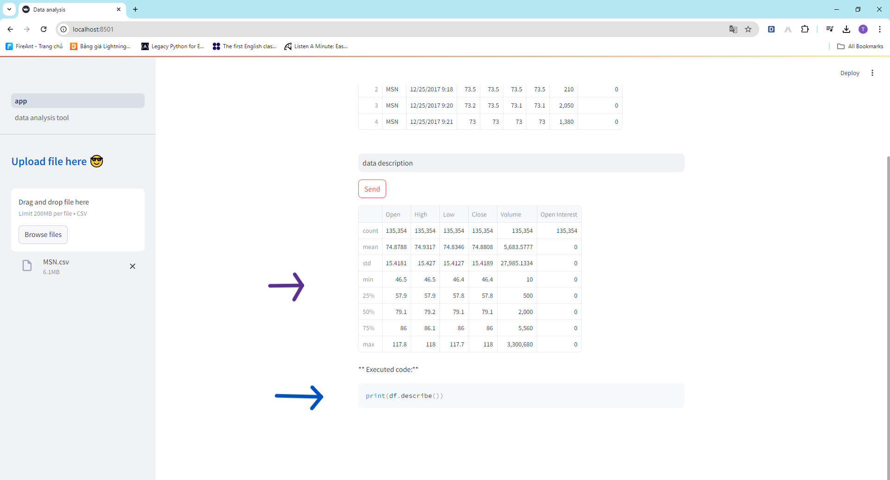
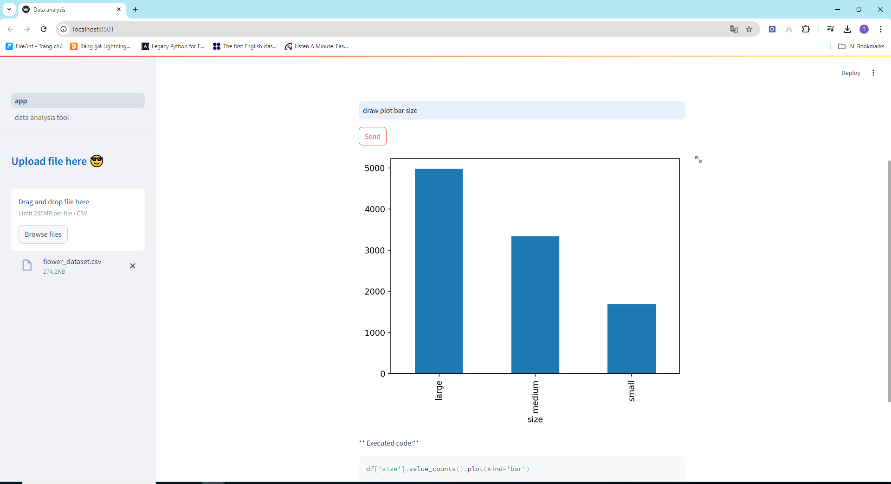
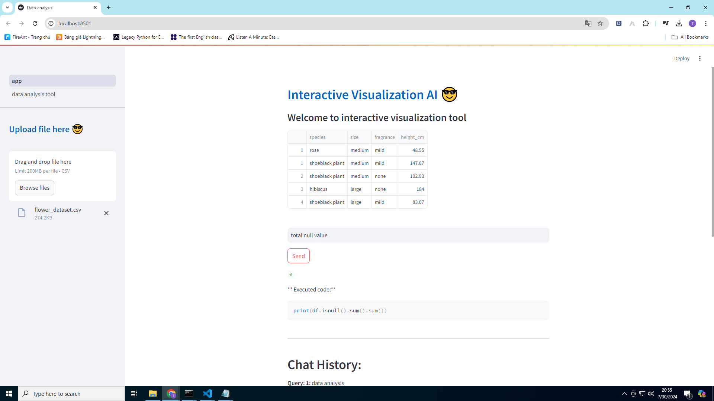
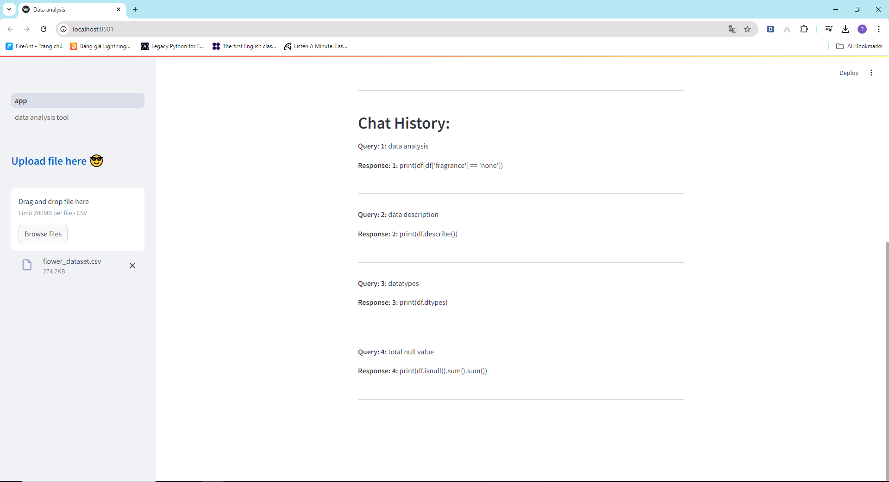
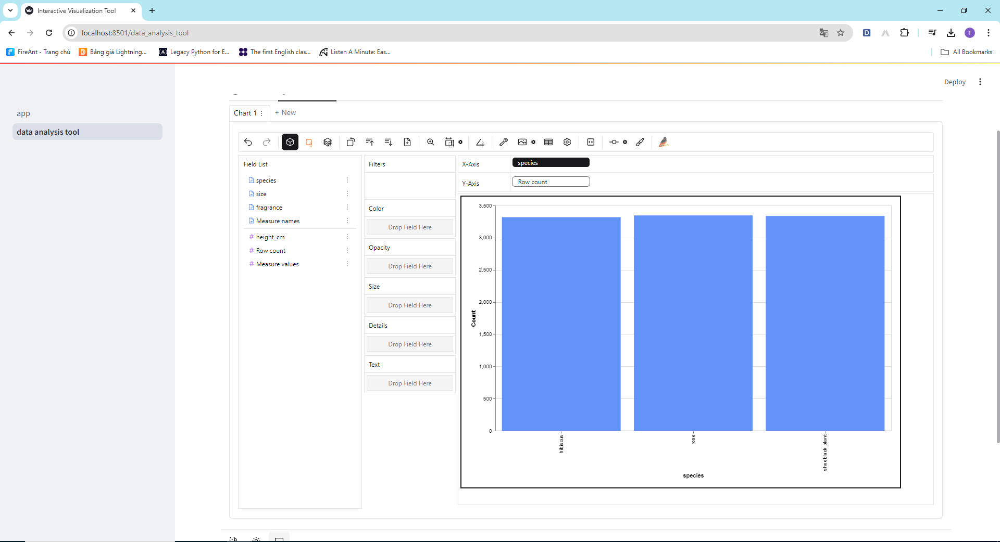

# Project Description:
**This project is created to help people whether they know how to code or not, they can still easily analyze data.**

- First, people can send a csv file
- Enter their requirements
- Then send the model, who will automatically analyze the results and code
- People can also use the tool to draw charts

